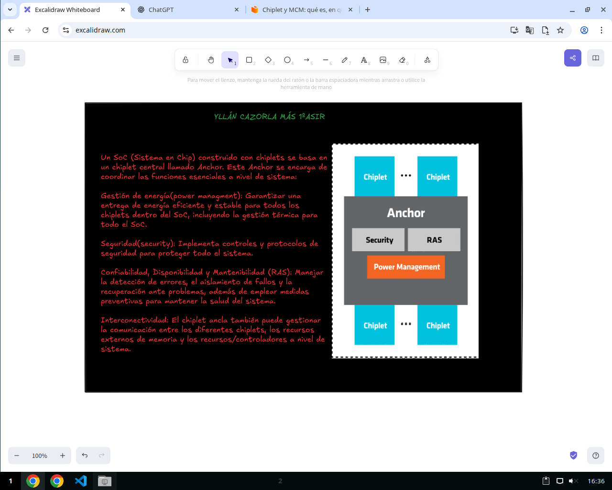
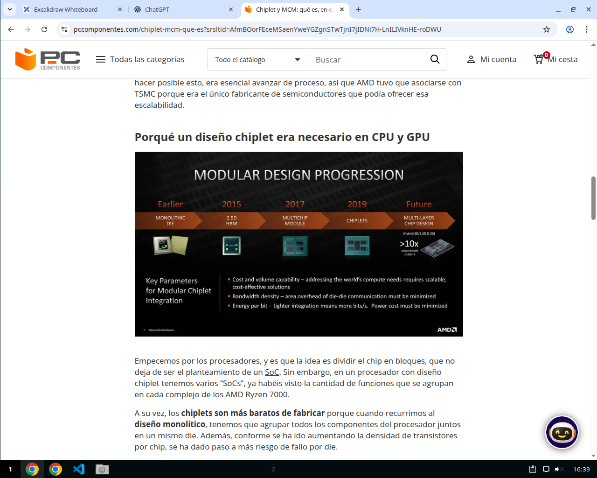
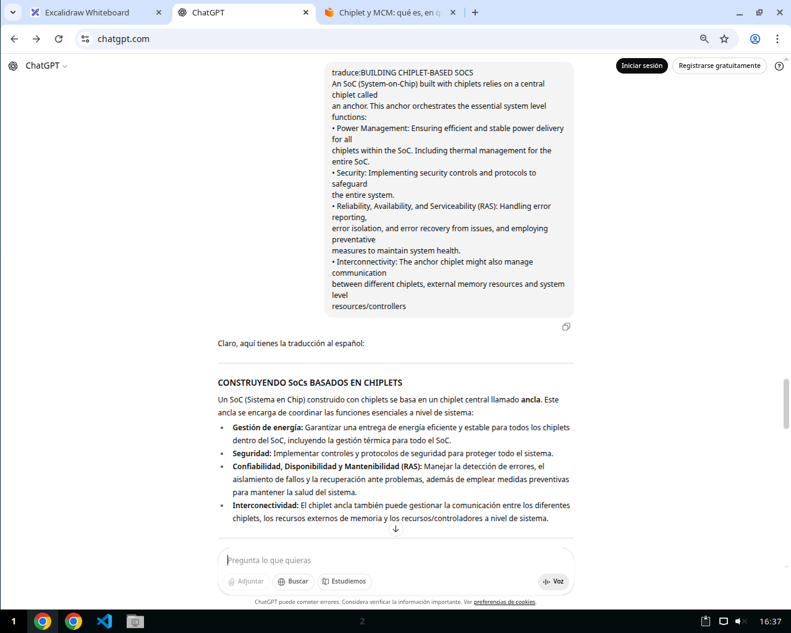
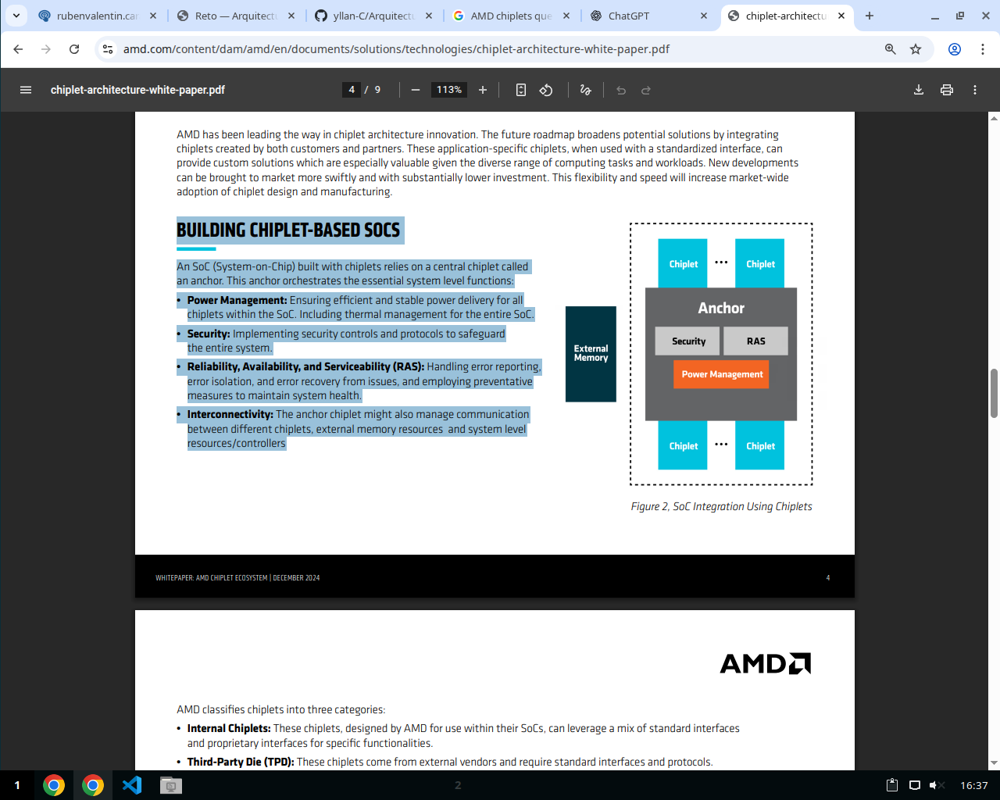

# Arquitectura moderna — A+B+C (sin lío de diagramas)

**Alumno/a: Yllán Cazorla Más**
**Grupo: 1ºASIR**
**AMD chiplets**

---

## A) Básico — Qué es y para qué sirve (3–5 líneas)

- **Son unos mini chips que se juntan en encapsulados para fabricar nuevas tecnologias**
- **Es una nueva forma de hacer procesadores usan los chiplets para hacer procesadores mas eficientes y rentables.**
- **La desventaja que tenian era la latencia que generaba por estar separados pero AMD creo una nueva forma de frabricarlos llamada Infinity Fabric la cual permite conectar los chiplets entre ellos aumentando su velocidad**

### Representación visual (bloques + breve función)

<!-- Sube aquí tu captura anotada desde Excalidraw -->

## B) Intermedio — Problema que mejora + comparativa

**Reduce los costos de fabricacion,mejora la escalabilidad gracias a su funcion de tener compatibilidad con otros chiplets permitiendo aumentar los chiplets para aumentar su rendimiento lo cual hace que sean mas flexibles que las demas formas ademas de permitir modificarlos sin necesidad de cambiar todos los demas lo que hace que si un chiplet se rompe se pueda cambiar por uno nuevo. Al ser varios reducen el calor gracias a que distribuye el calor entre los chiplets**

---

**Tabla comparativa (≥3 filas)**

| Aspecto                           | PC clásico monolítico                       | AMD CHIPLETS                                                                    |
| ----------------------------------- | ----------------------------------------------- | --------------------------------------------------------------------------------- |
| ISA(Instruction Set Architecture) | X86-X86-64                                    | x86-64 distribuido entre los chiplets                                           |
| Memoria                           | Integrada en la misma base                    | acceso distribuido entre los chiplets y gestionado por el chiplet anchor        |
| Interconexión                    | unida en la misma arquitectura                | separadas por ser chiplets pero unidos entre las conexiones del infinity fabric |
| Aceleradores                      | se meten el mismo chip pero mas lento         | se añaden mas chiplets para esa funcion                                        |
| Objetivo principal                | toda la capacidad y potencia en un mismo chip | Ser un diseño flexible para poder aumentar el rendimiento a futuro             |

---

> Nota: Crea un **glosario** en tu .md para los términos que no controles (por si te pregunto en clase).

### CAPTURA 2 — Fuente oficial/técnica

* **PCcomponentes:Fuente oficial**

https://www.pccomponentes.com/chiplet-mcm-que-es?srsltid=AfmBOorFEceMSaenYweYGZgnSTwTjnI7jIDNi7H-LnILIVknHE-roDWU

* **Chat GPT Para facilitar el entendimiento**

  https://chatgpt.com/

**AMD.com**

https://www.amd.com/content/dam/amd/en/documents/solutions/technologies/chiplet-architecture-white-paper.pdf

## C) Curioso — Dato/cifra + evidencia

**Dato/cifra (1 frase):** “La fuente indica … (poner aquí la cifra/etiqueta y modelo).”

### CAPTURA 3 — Dato/diagrama señalado

``

---

## Fuentes (≥2 enlaces)
